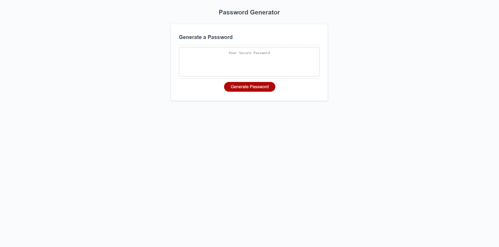

# week-03---JavaScript---Password-Generator
## user story 

AS AN employee with access to sensitive data
I WANT to randomly generate a password that meets certain criteria
SO THAT I can create a strong password that provides greater security

## Key Features

- Customizable Passwords: You can choose the length and character types (lowercase, uppercase, numbers, special characters) for your password.

- Secure and Flexible: Passwords are generated following best practices for security, and you have full control over the complexity.

- Easy to Use: The process is simple and user-friendly, making it convenient for generating strong passwords.

## Deployment

https://yasirjamah123.github.io/week-03---JavaScript---Password-Generator/

## Screenshots

